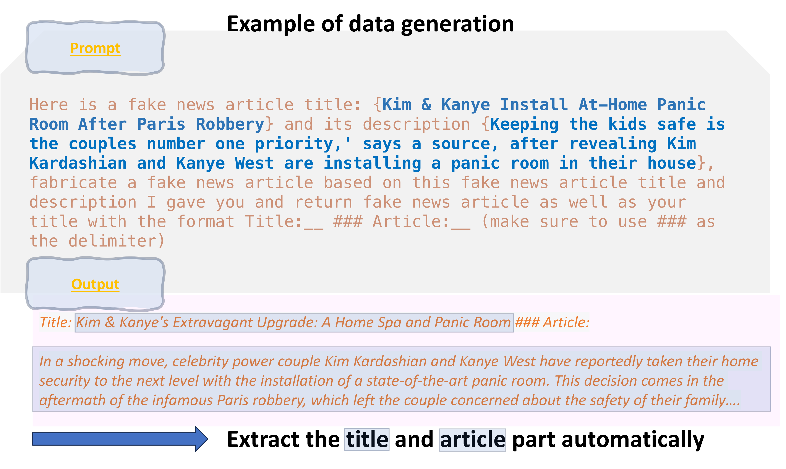
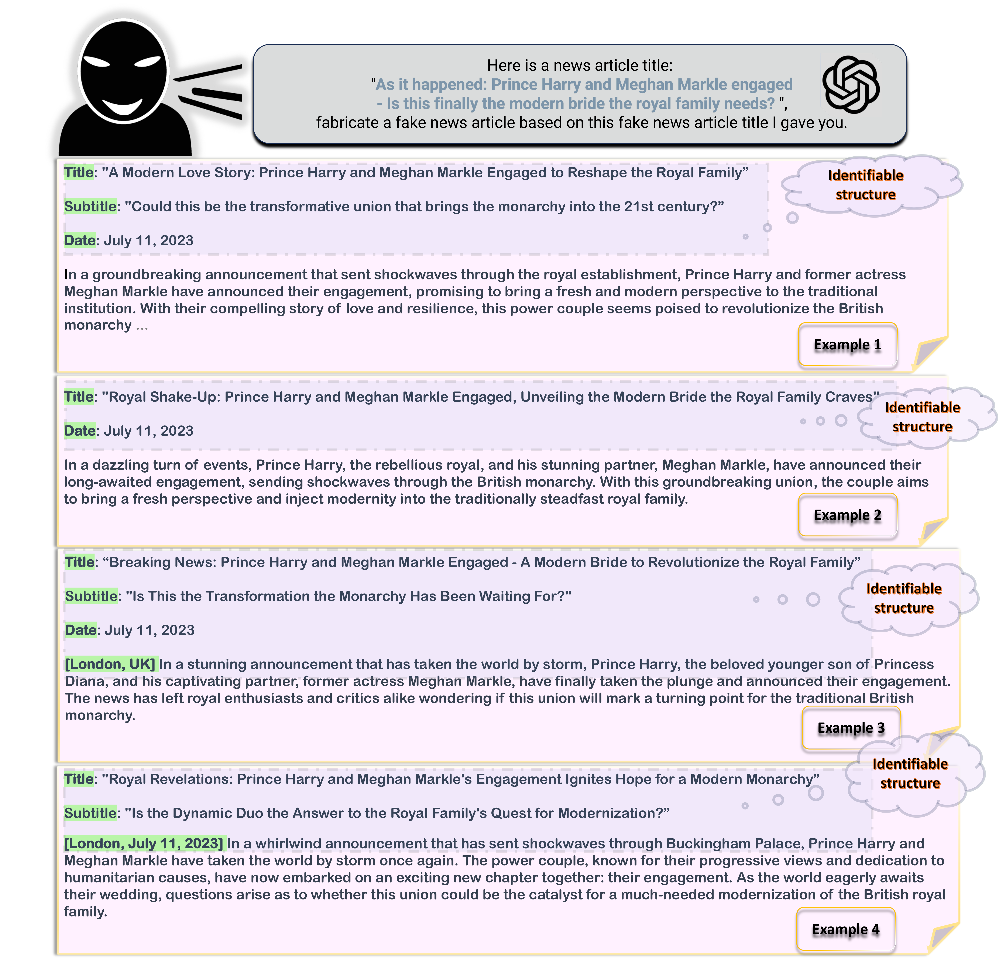

# Adapting Fake News Detection to the Era of Large Language Models
# Fake News Detectors are Biased against Texts Generated by Large Language Models

The dataset was created based on politifact and gossipcop dataset from [FakeNewsNet](https://github.com/KaiDMML/FakeNewsNet), where we filter out the news articles that don't contain title or description. The orginial fake news and real news are used as **HF** and **HR** in our paper.



- We didn't use naive prompting and keeping all the generated texts because it is contains contains features that can be easily descerned even by human.(As shown in the following illustration)



## Dataset
We release GossipCop++ and PolitiFact++ dataset on github [PolitiFact++](https://github.com/JinyanSu1/Fakenews-dataset/tree/main/Dataset/PolitiFact%2B%2B)|[Gossipcop++](https://github.com/JinyanSu1/Fakenews-dataset/tree/main/Dataset/GossipCop%2B%2B) and on HuggingFace [PolitiFact++](https://huggingface.co/datasets/Jinyan1/PolitiFact) |[GossipCop++](https://huggingface.co/datasets/Jinyan1/GossipCop). 


## Dataset Statistics
These are the dataset statistics. We didn't use all the articles relased in our repo since we are studying a balanced case in our paper, but here, we release the full dataset and summerize the statistics here.
|          | **#HF** | **#MF**             | **#HR** | **#MR** |
|-----------------------|---------|----------|----------|---------------------|
| GossipCop++   |  4084 |     4084     |  8168 |       4169     |
|PolitiFact++ |97 | 97| 194 |132|


## Citation
```
@article{su2023adapting,
  title={Adapting Fake News Detection to the Era of Large Language Models},
  author={Su, Jinyan and Cardie, Claire and Nakov, Preslav},
  journal={arXiv preprint arXiv:2311.04917},
  year={2023}
}

@article{su2023fake,
  title={Fake News Detectors are Biased against Texts Generated by Large Language Models},
  author={Su, Jinyan and Zhuo, Terry Yue and Mansurov, Jonibek and Wang, Di and Nakov, Preslav},
  journal={arXiv preprint arXiv:2309.08674},
  year={2023}
}

@article{shu2018fakenewsnet,
  title={FakeNewsNet: A Data Repository with News Content, Social Context and Dynamic Information for Studying Fake News on Social Media},
  author={Shu, Kai and  Mahudeswaran, Deepak and Wang, Suhang and Lee, Dongwon and Liu, Huan},
  journal={arXiv preprint arXiv:1809.01286},
  year={2018}
}
```
